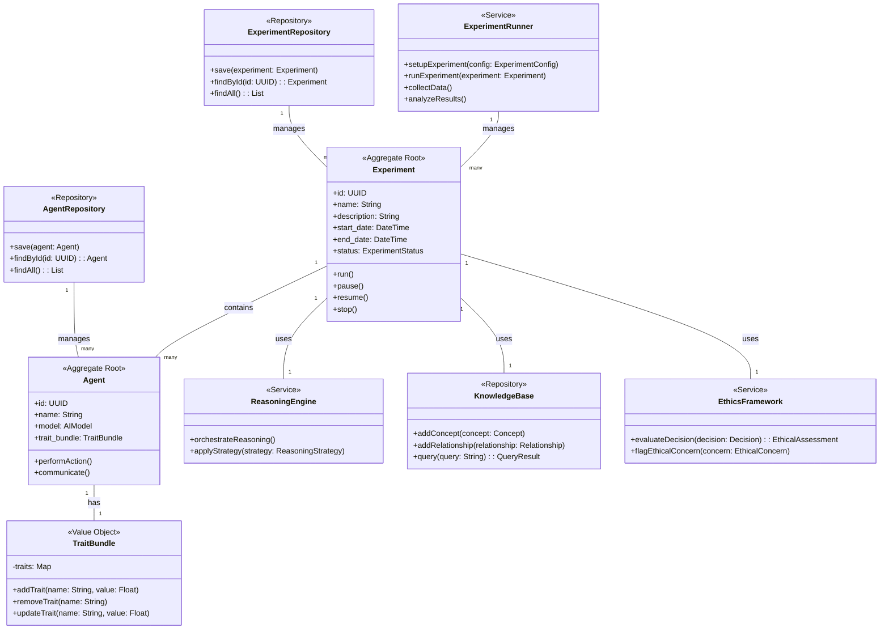

# Domain Model and Research Summary for AI Behavioral Experiment Testbed

## 1. System Overview

The AI Behavioral Experiment Testbed is a sophisticated platform designed for conducting complex behavioral and psychological experiments with AI agents. It focuses on studying the interactions between different behavioral trait bundles (roles) and provides researchers with a flexible, scalable environment for designing, executing, and analyzing experiments in AI behavior and collaboration.

This system is modeled using Unified Modeling Language (UML) and follows Domain-Driven Design (DDD) principles to ensure a clear and consistent representation of the domain.

### 1.1 UML Class Diagram

This UML class diagram represents the core domain entities, their relationships, and DDD concepts in our AI Behavioral Experiment Testbed.

### 1.2 Domain-Driven Design Concepts

- **Bounded Context**: The AI Behavioral Experiment Testbed represents a single bounded context focused on AI agent experiments.
- **Aggregates**: 
  - Experiment (root entity)
  - Agent (root entity)
- **Entities**: Experiment, Agent
- **Value Objects**: TraitBundle, ExperimentConfig, Decision, EthicalAssessment
- **Domain Events**: ExperimentStarted, ExperimentCompleted, EthicalConcernRaised
- **Repositories**: ExperimentRepository, AgentRepository, KnowledgeBase
- **Services**: ReasoningEngine, EthicsFramework, ExperimentRunner
- **Factories**: ExperimentFactory, AgentFactory (not shown in the diagram)
- **Domain Services**: ReasoningEngine, EthicsFramework

### 1.3 DDD Patterns Applied

1. **Aggregate Pattern**: Experiment and Agent are designed as aggregate roots, encapsulating related entities and value objects.
2. **Repository Pattern**: ExperimentRepository and AgentRepository provide a collection-like interface for accessing and persisting aggregates.
3. **Factory Pattern**: (Not shown in the diagram) ExperimentFactory and AgentFactory would be responsible for creating complex Experiment and Agent instances.
4. **Service Pattern**: ReasoningEngine, EthicsFramework, and ExperimentRunner are stateless services that perform domain-specific operations.
5. **Value Object Pattern**: TraitBundle is implemented as a value object, representing a collection of traits without a distinct identity.

### 1.4 Ubiquitous Language

To ensure a shared understanding across all stakeholders, we maintain a glossary of domain-specific terms in our `ubiquitous_language.md` file. This includes definitions for key concepts such as Experiment, Agent, TraitBundle, and domain-specific processes.

This system is modeled using Unified Modeling Language (UML) and follows Domain-Driven Design (DDD) principles to ensure a clear and consistent representation of the domain.

### 1.1 UML Diagram

This UML class diagram represents the core domain entities and their relationships in our AI Behavioral Experiment Testbed.

### 1.2 Domain-Driven Design Concepts

- **Bounded Context**: The AI Behavioral Experiment Testbed represents a single bounded context focused on AI agent experiments.
- **Aggregates**: 
  - Experiment (root entity)
  - Agent (root entity)
  - TraitBundle (value object)
- **Entities**: Experiment, Agent, ReasoningEngine, KnowledgeBase, EthicsFramework, ExperimentRunner
- **Value Objects**: TraitBundle, ExperimentConfig, Decision, EthicalAssessment
- **Domain Events**: ExperimentStarted, ExperimentCompleted, EthicalConcernRaised
- **Repositories**: ExperimentRepository, AgentRepository, KnowledgeBaseRepository

## 2. Core Components

### 2.1 Agent Abstraction
- Represents individual AI entities with specific behavioral traits
- Encapsulates AI models (e.g., GPT-4, Claude), reasoning strategies, and communication interfaces
- Implements behavioral traits based on psychological theories (e.g., Five-Factor Model)

### 2.2 Reasoning Engine
- Orchestrates collaborative reasoning processes between agents
- Implements various reasoning strategies and decision-making algorithms
- Manages information flow and task allocation among agents

### 2.3 Knowledge Base
- Graph database (Neo4j) for storing concepts, relationships, and versioned configurations
- Manages principles, heuristics, and learned information

### 2.4 Ethics Framework
- Ensures adherence to predefined ethical guidelines
- Implements real-time ethical constraint checking
- Provides mechanisms for ethical impact assessment and bias detection

### 2.5 Experiment Runner
- Facilitates design and execution of complex behavioral-psychological experiments
- Implements the Experiment Design Language (EDL) for standardized experiment specification
- Manages data collection, analysis, and visualization of experimental results

### 2.6 User Interface
- Provides real-time, interactive web interface for experiment design and monitoring
- Offers visualization tools for experiment progress and results analysis

## 3. Key Features

- Multiple AI experts with different roles (e.g., Analyst, Creative, Critic, Synthesizer, Ethicist)
- Flexible trait bundle system based on psychological theories
- Multi-API support for seamless integration with various AI models
- Turn-based discussion system with moderated conversation flow
- Dynamic expert pool evolution based on performance
- Comprehensive experiment runner for behavioral-psychological tests
- Real-time monitoring and visualization of agent interactions
- Robust ethical considerations and bias mitigation strategies

## 4. Research Focus Areas

### 4.1 Cognitive Architectures for AI
- Investigating the implementation of cognitive models (e.g., ACT-R, SOAR) in AI agents
- Studying the impact of different cognitive architectures on agent decision-making and learning processes
- Exploring the potential of large language model-based architectures for complex reasoning tasks
- Integrating cognitive modeling techniques for task switching and multitasking scenarios
- Comparing the effectiveness of different cognitive architectures in AI agent development

### 4.2 Multi-Agent Interactions
- Exploring emergent behaviors in multi-agent systems, including language-based coordination and swarm intelligence
- Analyzing the effects of different communication protocols on collaborative outcomes
- Investigating cooperative and competitive dynamics in multi-agent deep reinforcement learning
- Simulating complex scenarios using large language model-based multi-agent systems
- Developing massively multi-task environments for more comprehensive AI agent training
- Studying the emergence of complex behaviors in large-scale multi-agent simulations
- Implementing swarm robotics principles for cooperative control in multi-agent systems
- Exploring containment control strategies in multi-agent systems
- Investigating the role of emergent language in deep multi-agent coordination
- Applying coevolutionary theory with LLMs for emergent cooperation and strategy adaptation
- Balancing collective exploration and exploitation in multi-agent and multi-robot systems
- Optimizing latency-aware multi-joint placement and routing using swarm intelligence
- Developing decentralized decision-making models for multi-agent systems

### 4.3 Ethical AI and Decision Making
- Implementing and evaluating various ethical frameworks in AI systems
- Studying the impact of ethical constraints on agent behavior and decision-making
- Integrating responsible AI practices in information systems and research contexts
- Addressing ethical concerns specific to large language models in academic and research environments
- Investigating ethical considerations in specialized AI applications, such as healthcare and machine listening
- Developing comprehensive frameworks for ethical AI development and deployment

### 4.4 Explainable AI (XAI)
- Developing techniques for improving transparency and interpretability of agent decisions
- Investigating the trade-offs between model performance and explainability
- Exploring methods to enhance the explainability of AI decision-making processes in various domains
- Studying the impact of explainability on trust in AI systems, particularly in clinical settings
- Implementing collective explainable AI techniques for cooperative strategies in multi-agent systems
- Utilizing Shapley values to explain agent contributions in multiagent reinforcement learning
- Exploring fuzzy AI approaches for computationally efficient and explainable solutions
- Investigating virtual reality-based visualization techniques for explainable AI in decision-making processes
- Implementing multi-valued action reasoning systems for improved explainability in complex decision scenarios
- Implementing collective explainable AI techniques for cooperative strategies in multi-agent systems
- Utilizing Shapley values to explain agent contributions in multiagent reinforcement learning
- Exploring fuzzy AI approaches for computationally efficient and explainable solutions
- Investigating virtual reality-based visualization techniques for explainable AI in decision-making processes
- Implementing multi-valued action reasoning systems for improved explainability in complex decision scenarios

### 4.5 Bias Detection and Mitigation
- Implementing advanced techniques for identifying and mitigating biases in AI systems
- Studying the propagation of biases in multi-agent interactions
- Developing strategies to address biases in AI applications across diverse industries
- Investigating regulatory approaches to bias measurement and mitigation in AI
- Exploring the relationship between bias mitigation and fairness in AI systems
- Applying federated learning techniques for bias mitigation in distributed AI systems
- Investigating ethical considerations and solutions for ensuring fairness in AI-driven financial services
- Addressing privacy, bias, and accountability issues in AI deployment across various sectors
- Developing comprehensive frameworks for ethical AI development and bias mitigation
- Analyzing and mitigating biases for vulnerable classes in datasets and AI models

### 4.6 Long-term Adaptation and Learning
- Investigating methods for long-term knowledge retention and skill transfer in AI agents
- Studying the evolution of agent behaviors over extended periods
- Exploring techniques for continuous learning and adaptation in dynamic environments
- Developing strategies for AI agents to generalize knowledge across different domains and tasks
- Implementing hierarchical compound intrinsic value reinforcement learning for complex behaviors in multi-agent cooperation
- Utilizing hybrid AI models combining unsupervised and self-supervised learning for long-term adaptation in complex environments
- Optimizing long-term efficiency and fairness in multi-agent systems through reinforcement learning
- Developing metareasoning frameworks for enhancing artificial reasoning about uncertain information in complex decision-making environments
- Applying Hebbian learning techniques for predicting and adapting to evolving clusters in multi-agent game environments

### 4.7 Cultural and Contextual Factors in AI Behavior
- Exploring the impact of cultural context on AI decision-making and interactions
- Developing methods for creating culturally-aware AI systems
- Investigating the role of context in specialized AI applications (e.g., medical record analysis)
- Studying the influence of cultural factors on AI interpretation and decision-making in various domains

### 4.8 Emotion Modeling in AI
- Implementing emotion models in AI agents based on psychological theories
- Studying the impact of simulated emotions on agent interactions and decision-making
- Exploring the potential of emotion recognition and generation in AI communication
- Investigating the role of emotional intelligence in AI-human interactions

### 4.9 Collective Intelligence and Swarm Behavior
- Investigating emergent collective behaviors in large-scale multi-agent systems
- Studying the application of swarm intelligence principles to AI collaboration
- Exploring the potential of collective AI decision-making in complex problem-solving scenarios
- Developing frameworks for coordinating large numbers of AI agents in multi-task environments

### 4.10 Advanced Natural Language Processing
- Exploring the use of large language models for more natural and context-aware agent communications
- Investigating the impact of advanced NLP capabilities on multi-agent collaboration and problem-solving
- Studying the evolution of prompt engineering techniques and their applications in AI systems
- Evaluating the performance of large language models in specialized domains, such as medical guideline interpretation
- Investigating the implications of advanced language models on scholarly integrity and academic research

### 4.11 Privacy-Preserving AI
- Implementing federated learning and differential privacy techniques in multi-agent systems
- Studying the trade-offs between privacy preservation and system performance
- Exploring privacy-preserving methods for AI applications in sensitive domains (e.g., healthcare)
- Investigating the balance between data sharing and privacy in clinical AI applications

### 4.12 AI Robustness and Generalization
- Developing techniques to improve AI agents' ability to perform well across different scenarios
- Investigating the impact of adversarial training and domain randomization on agent behavior
- Studying methods to enhance AI system reliability and adaptability in diverse applications
- Exploring robustness against common corruptions in unsupervised domain adaptation
- Developing certification methods for robust generalization in AI systems
- Implementing domain generalization techniques for retail applications, such as checkout systems
- Exploring multimodal AI systems for improved out-of-distribution generalization in medical applications
- Developing domain generalization strategies for multi-camera, multi-target tracking systems
- Investigating AI-based intrusion detection systems for robust performance in automotive networks
- Addressing bias and generalization challenges in AI systems for medical imaging across diverse patient populations

### 4.13 AI in Specialized Domains
- Investigating AI applications in various industries (e.g., energy, healthcare, agriculture)
- Studying the unique challenges and opportunities of AI integration in specialized fields
- Exploring the potential of AI to revolutionize decision-making processes in different sectors
- Evaluating AI performance in complex domains such as robotic surgery and cognitive impairment detection
- Investigating the translation of AI models from research to clinical practice
- Implementing domain generalization techniques to improve AI performance across different scenarios
- Developing multimodal AI systems to enhance out-of-distribution generalization in medical applications
- Exploring domain adaptation strategies for multi-camera, multi-target tracking systems
- Investigating robust AI-based intrusion detection systems for automotive networks
- Addressing bias and generalization challenges in AI systems for medical imaging across diverse patient populations

### 4.14 AI Reproducibility and Data Quality
- Developing best practices for ensuring reproducibility in AI experiments
- Investigating the impact of data quality and metadata on AI system performance
- Exploring methods to enhance AI readiness and reproducibility across different research contexts
- Studying the role of trust and transparency in the adoption of AI systems in clinical settings
- Developing standardized protocols for AI model validation and reproducibility testing

## 5. Ethical Considerations

- Adherence to established ethical guidelines (e.g., IEEE Global Initiative on Ethics of Autonomous and Intelligent Systems)
- Implementation of continuous ethical assessment throughout experiments
- Mechanisms for stakeholder engagement and civil society input in AI development processes
- Robust privacy protection measures for data collection and analysis
- Ongoing efforts to improve explainability and transparency in AI decision-making
- Integration of AI ethics education in relevant fields, including medicine and information systems
- Addressing ethical concerns specific to large language models in academic and research contexts
- Developing responsible AI practices that balance innovation with ethical considerations
- Implementing ethical frameworks for AI applications in sensitive domains (e.g., healthcare, finance)
- Ensuring fairness and avoiding bias in AI decision-making processes across various sectors
- Considering the long-term societal impacts of AI systems and their influence on human decision-making
- Establishing guidelines for ethical AI research and experimentation, including multi-agent simulations
- Developing comprehensive strategies for bias detection and mitigation in AI systems
- Addressing ethical aspects of machine listening and other AI technologies in healthcare settings
- Ensuring the integrity of scholarly writing and academic research in the age of advanced language models
- Implementing robust measures for data privacy and security in AI applications, especially in clinical settings
- Developing ethical guidelines for the use of AI in specialized domains such as robotic surgery and cognitive assessment
- Addressing the ethical implications of large-scale multi-agent simulations and their potential real-world impacts

## 6. Future Directions

- Integration of more advanced cognitive architectures and emotion models
- Development of more sophisticated multi-agent communication protocols
- Enhanced long-term learning and adaptation capabilities for AI agents
- Improved techniques for bias detection and mitigation in complex multi-agent systems
- Advanced visualization tools for better understanding of agent interactions and decision processes
- Expansion of the Ethics Framework to address emerging ethical challenges in AI research

## 7. Conclusion

The AI Behavioral Experiment Testbed provides a robust platform for cutting-edge research in AI behavior, multi-agent interactions, and ethical AI development. By combining advanced AI technologies with insights from psychology, ethics, and cognitive science, this testbed enables researchers to explore complex questions about AI behavior, collaboration, and decision-making in controlled, reproducible environments.
