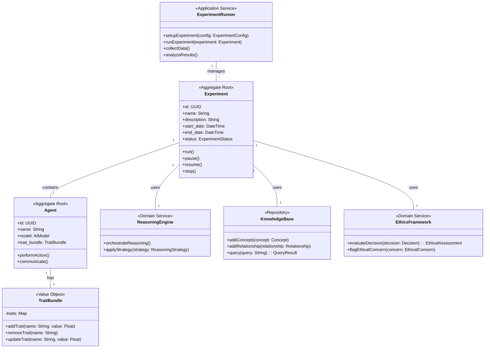

# UML Class Diagram for AI Behavioral Experiment Testbed

This class diagram provides a visual representation of the core components in our AI Behavioral Experiment Testbed, showing their relationships and key attributes/methods.
